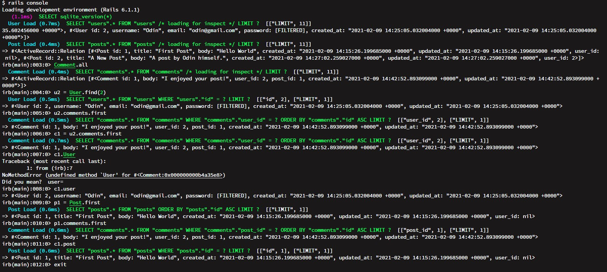

# Active Records Model of Micro-Reddit

This project is built on the fundamentals of creating a database structure that allows a user to send a post and comment on other posts.



## Build-With

- Ruby -v  2.7.2
- Rails -v 6.0
- SQLite3
- VScode


## Getting Started

### Prerequisites

To get this project up and running locally, you must already have ruby and necessary gems installed on your computer

**To get this project set up on your local machine, follow these simple steps:**

1. Open Terminal.
2. Navigate to your desired location to download the contents of this repository.
3. Copy and paste the following code into the Terminal: git clone git@github.com:Leandro-Barretoo/micro_reddit_rails.git
4. cd```micro_reddit_rails```.
5. Run ```bundle install``` to get the necesary gems.
6. Run `rails db:migrate`.


## Author Details::

👤 **Leandro Barreto**

- Github: [@Leandro-Barretoo](https://github.com/Leandro-Barretoo)

👤 **Ashaka Egerega**

- Github: [@AshakaE](https://github.com/AshakaE)

## Acknowledgment
The resources we have used to develop our project:

- [Odin-project](https://www.theodinproject.com/courses/ruby-on-rails/lessons/building-with-active-record-ruby-on-rails)
- [micro reddit walkthrough](https://jberczel.github.io/micro-reddit-walkthrough/)
- [Guides](https://guides.rubyonrails.org/active_record_validations.html#length)

## Show your support

Give ⭐ Star me on GitHub — it helps!

## 📝 License

This project is [MIT](lic.url) licensed.  

